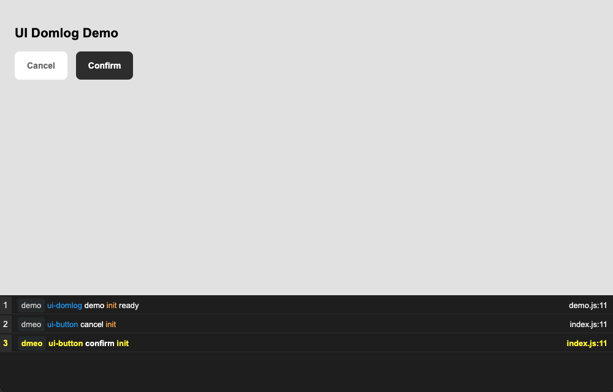
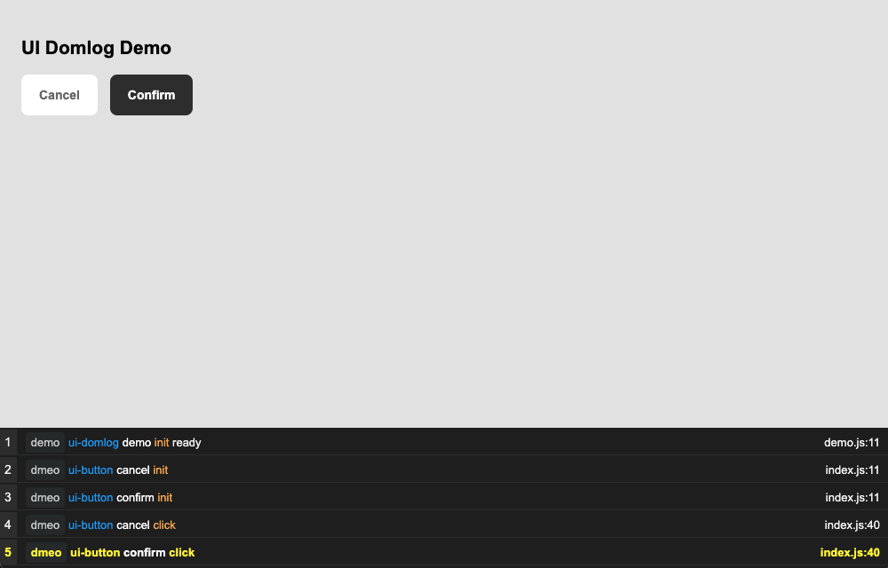
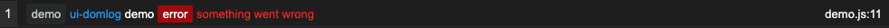

# ui-domlog
Debug log for console.log() to display on the body's DOMElement, and trace every action from UI component/module.

## Install
```
npm i ui-domlog
```

## Demo


## How to use
### Require plugin
```js
const bel = require('bel')
const csjs = require('csjs-inject')
...
const domlog = require('ui-domlog')
```
### Make a new Promise()
Use ```new Promise()``` within ```sendMessage``` to ```domlog```, and return a DOMElement with ```resolve()```
```js
async function sendMessage (message) {
    return await new Promise( (resolve, reject) => {
        if (message === undefined) reject('no message import')
        const log = domlog(message)
        return resolve(log)
    }).catch( err => { throw new Error(err) } )
}
```

### Create DOMElement
To implement demo on the document
```js
let terminal = bel`<div class=${css.terminal}></div>`
const container = wrap(content, terminal)

function wrap (content) {
const container = bel`
  <div class=${css.wrap}>
      <section class=${css.container}>
          ${content}
      </section>
      ${terminal}
  </div>
  `
  return container
}
```

### Add CSS style
```js
const css = csjs`
html {
    box-sizing: border-box;
}
*, *::before, *::after {
    box-sizing: inherit;
}
body {
    margin: 0;
    padding: 0;
    font-family: Arial, Helvetica, sans-serif;
    font-size: 14px;
    background-color: rgba(0, 0, 0, .1);
    height: 100%;
}
.wrap {
    display: grid;
    grid-template-columns: 1fr;
    grid-template-rows: 75vh 25vh;
}
.container {
    padding: 25px;
    overflow-y: auto;
}
.container > div {
    margin-bottom: 20px;
}
.container > div button {
    margin-right: 10px;
}
.content {}
.terminal {
    background-color: #212121;
    color: #f2f2f2;
    font-size: 13px;
    overflow-y: auto;
}
`
```

## Event log
For example:
Trigger event when button click
```js
// button
const confirm = button({page: 'dmeo', name: 'confirm', content: 'Confirm', style: 'solid', color: 'dark'}, protocol('confirm'))
// content
const content = bel`
<div class=${css.content}>
    <h1>UI Domlog Demo</h1>
    <div>${cancel} ${confirm}</div>
</div>`
...
// content goes here
const container = wrap(content, terminal)
```
Button's protocol
```js
function protocol(name) {
    return send => {
        recipients[name] = send
        return function receiveClick(message) {
            sendMessage(message).then( log =>  { 
                terminal.append(log) 
                terminal.scrollTop = terminal.scrollHeight
            })
        }
    }
}
```


## Error log
```js
const log = domlog({page: 'demo', from: 'demo', flow: 'ui-domlog', type: 'error', body: 'something went wrong', filename, line: 11})
```
